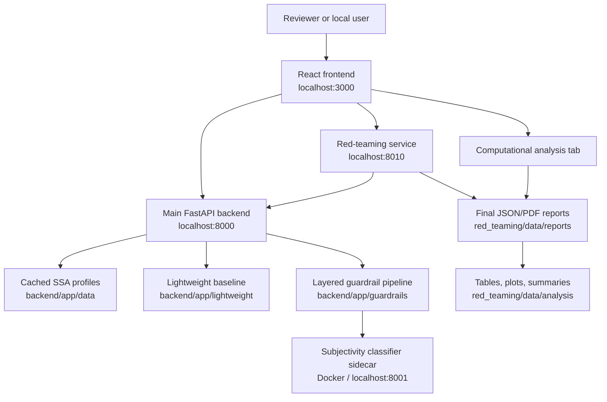

# Project Architecture

This repository is organized around runtime boundaries rather than implementation
details:

- `backend/main.py` is the ASGI entrypoint used by Uvicorn.
- `backend/app/server.py` builds the FastAPI application, middleware, routes, and
  lifespan hooks.
- `backend/app/lifecycle.py` owns startup/background tasks such as daily rate
  limit reset and guardrail classifier warmup.
- `backend/app/api/` contains HTTP route modules.
- `backend/app/services/` contains application workflows used by APIs.
- `backend/app/guardrails/pipeline.py` remains the single ordered orchestrator
  for the guardrail pipeline. It should continue to call each guardrail layer one
  by one in sequence.
- `backend/app/guardrails/dynamic_request.py` provides shared deterministic
  request-intent signals used by the judge, generator, and post-processors.
- `backend/app/lightweight/` contains the profile-only baseline pipeline used
  for unrestricted chat and red-team comparison.
- `red_teaming/app/` contains the standalone black-box runner, evaluator LLM
  grading, optional human overrides, final report storage, and backend-facing
  API routes.
- `red_teaming/computational_analysis/` contains reproducible report loading,
  paired guardrail-effect metrics, thesis figures, CSV tables, summaries, and
  artifact bundles.
- `frontend/src/config/` contains runtime configuration such as API URLs.
- `frontend/src/features/` contains domain-oriented React UI modules.
- `frontend/src/features/analysis/` contains the saved-report analysis
  workspace and per-plot download controls.
- `frontend/src/features/*/*Api.js` contains browser API clients for a feature.
- `frontend/src/features/*/use*.js` contains feature state and orchestration hooks.
- Feature CSS should live beside the feature when it is not global layout CSS.
- `frontend/src/modules/` contains legacy/chat panel modules that can be migrated
  feature by feature.

## Runtime Diagram

The key experimental comparison is between `Lightweight` and `Guardrails` for
the same profile and prompt. Red-teaming stores those paired outputs in final
JSON reports, and computational analysis turns the saved reports into thesis
figures and summary tables.

## Guardrail Pipeline Rule

Keep the high-level guardrail flow in `backend/app/guardrails/pipeline.py`.
Individual guardrail layer implementations can stay modular under numbered layer
folders, but the end-to-end order should remain visible in one orchestration
file.

## Verification

Run `bash scripts/smoke_check.sh` before and after large refactors. It compiles
the Python services, checks core FastAPI route registration, and builds the
frontend production bundle.
