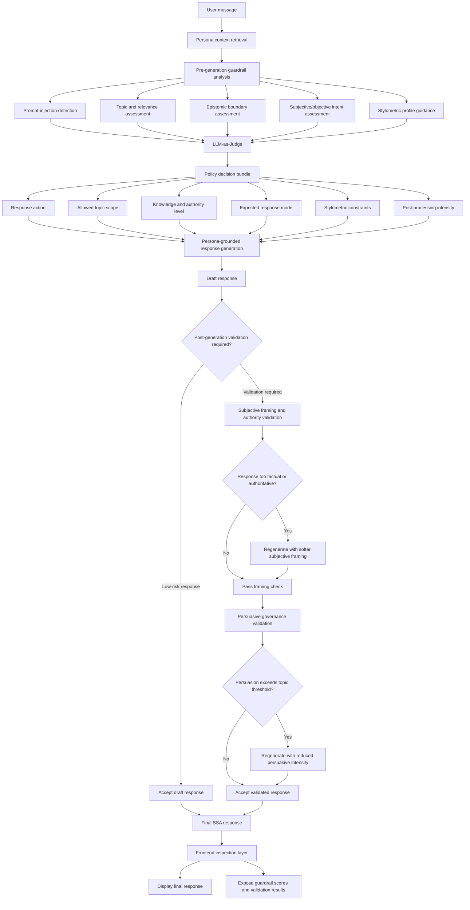

# SSA Guardrail Flow

This diagram shows the core runtime flow from a user message to the final
validated Synthetic Social Agent response. It is intentionally simplified for
methodological documentation: implementation details such as request locking,
rate limits, streaming mechanics, and frontend state handling are omitted.

For a teacher or thesis reader, this diagram is the high-level argument: system
integrity is produced by several policy decisions, not by one generic safety
filter. For a user running the app, it explains why the frontend can show
multiple inspection values for a single message.

## Reading The Flow

The system first retrieves the persona context and performs pre-generation
guardrail analysis. These signals are passed to the LLM-as-Judge, which produces
a policy decision bundle rather than a single allow/refuse decision. That bundle
sets the response action, topic scope, knowledge and authority level, expected
response mode, stylometric constraints, and post-processing intensity.

The response generator then produces a persona-grounded draft under these
constraints. If the response is low-risk, it may be accepted directly. Otherwise,
post-generation validation checks whether the response is too factual,
authoritative, or persuasive for the selected topic and mode. When needed, the
system regenerates the response with softer subjective framing or reduced
persuasive intensity before returning the final validated SSA response.

The frontend inspection layer displays the final response and exposes the
guardrail scores, validation decisions, and rewrite reasons attached to the
message.
