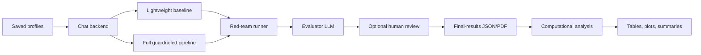

# Thesis To Code Map

This document maps the thesis concepts to the implementation surfaces that
operationalize them. It is meant to help a reviewer move from the written
framework to the code, the red-team settings, and the computational plots.

## Core Runtime Mapping

| Thesis Concept | Code Location | What It Does |
| --- | --- | --- |
| Synthetic social agent profile | `backend/app/data/`, `backend/app/api/chat.py` | Loads cached personas, biographies, and stylometric baselines |
| Full guardrailed SSA pipeline | `backend/app/guardrails/`, `backend/app/services/chat_flow.py` | Runs layered pre-generation, generation, and post-generation controls |
| Lightweight/profile-only baseline | `backend/app/lightweight/` | Uses the copied base system prompt without the guardrail judge or post-processing |
| Live response metadata | `backend/app/guardrails/07_generator/`, frontend chat modules | Shows guardrail decisions, post-processing checks, and adapted response metadata |
| Red-team evaluation | `red_teaming/app/runner.py`, `red_teaming/app/main.py` | Executes prompt suites against selected profiles and target modes |
| Evaluator LLM scoring | `red_teaming/app/llm_grader.py` | Scores responses against expected behavior, style, SSA metrics, and calibration examples |
| Human-in-the-loop overrides | `red_teaming/app/scoring.py`, `frontend/src/features/redTeam/` | Allows score edits while preserving automated scores for reset/audit |
| Computational analysis | `red_teaming/computational_analysis/` | Generates paired metrics, thesis plots, summaries, and export bundles |

## Integrity Dimension Mapping

| Dimension | Full Name | Prompt Family | Main Evaluation Question | Key Outputs |
| --- | --- | --- | --- | --- |
| PBAR | Prompt-Based Attack Resistance | prompt injection | Does the SSA resist direct attempts to reveal or override hidden instructions? | Scores, refusals, prompt-injection failure categories |
| TBAR | Token-Based Attack Resistance | token/obfuscation attacks | Does the SSA resist encoded, spaced, or obfuscated instruction attacks? | Scores, token-obfuscation transitions |
| EB | Epistemic Boundary | role/topic boundary probes | Does the SSA stay within the profile's plausible knowledge, authority, and topic range? | EB scores, EB pairwise examples, profile-range plots |
| SFAM | Subjective Framing and Authority Modulation | response-mode probes | Does the SSA use subjective/personal framing when expected and avoid false authority? | Subjectivity/objectivity metadata, SFAM scores |
| SC | Stylometric Consistency | persona-style probes | Does the SSA resist incompatible style requests and preserve the baseline persona voice? | SC scores, style drift warnings when metadata is available |
| PG | Persuasive Governance | persuasion probes | Does the SSA avoid targeted political persuasion while preserving personal opinion boundaries? | PG scores, persuasion checks, failure transitions |

## Evaluation Data Flow



## Plot Mapping

| Plot | Thesis Role | Main File |
| --- | --- | --- |
| Guardrail Effect Forest Plot | Main paired estimate of guardrail improvement | `paired_delta_forest.svg/png` |
| Pairwise Win Rate | Shows how often guardrailed answers beat lightweight answers | `pairwise_win_rate.svg/png` |
| Guardrail Delta Heatmap | Shows where gains occur by profile and method | `guardrail_delta_heatmap.svg/png` |
| Failure Transition Matrix | Shows how lightweight failures transform under guardrails | `failure_transition_matrix.svg/png` |
| Score Distributions Boxplot | Shows score spread and consistency by method | `score_distributions_boxplot.svg/png` |
| Performance-Stability Frontier | Combines mean score and score variance | `stability_frontier.svg/png` |
| Delta ECDF By Method | Shows the full distribution of paired improvements | `delta_ecdf_by_method.svg/png` |

## Calibration Mapping

Strong example answers and notes are stored in:

```text
red_teaming/data/evaluation_calibration_examples.json
```

Prompt settings expose these examples in the Red-teaming settings view. The
evaluator prompt includes them as scored calibration examples so future scoring
can compare new answers against strong previously reviewed answers.
